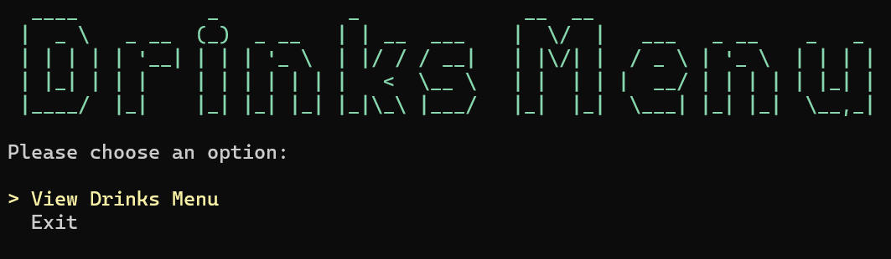
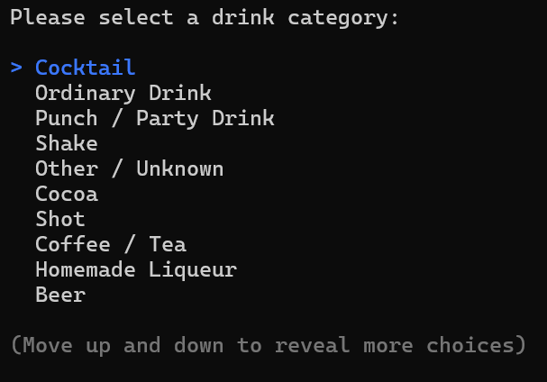
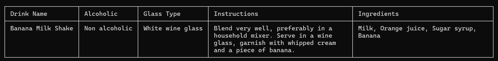

# Drinks Menu Console App

A simple C# console application that displays a drinks menu and shows the drink details.



## Features

- View a list of available drinks by category
- Select category and see the drinks available for that category
- View drink detailed information





## Getting Started

1. Clone the repository:
   ```bash
   git clone https://github.com/andymartinez1/Drinks-Menu.git
   ```
2. Navigate to the project directory:
   ```bash
   cd Drinks-Menu
   ```
3. Build and run the app:
   ```bash
   dotnet run
   ```

## Usage

Follow the on-screen prompts to select drinks and view the details.

## Requirements

- .NET 9.0 or later

## Technologies used

- C# and .NET
- Spectre Console
